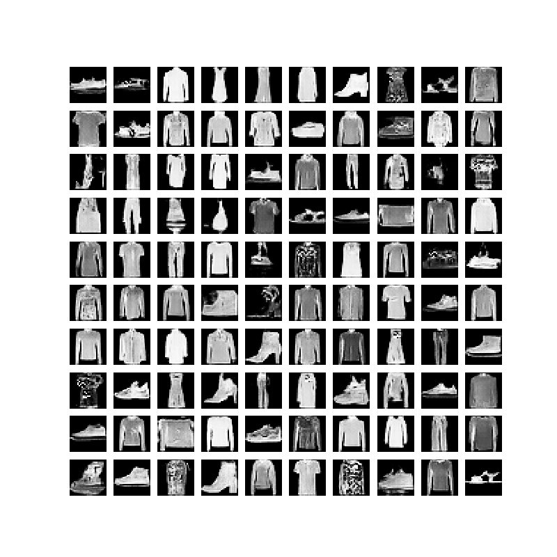
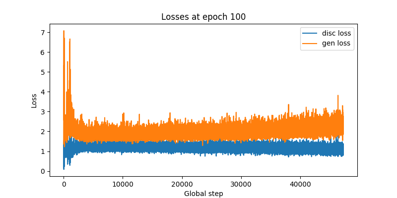

# Keras (TensorFlow) implementation of RaGAN.
  
This is an implementation of a Relativistic Average GAN, introduced in ["The relativistic discriminator: a key element missing from standard GAN".](https://arxiv.org/abs/1807.0073)
The original Pytorch code is found [here](https://github.com/AlexiaJM/RelativisticGAN).

## Usage

  1. Download the ([Fashion](https://www.kaggle.com/zalando-research/fashionmnist/data))-[MNIST](https://www.kaggle.com/oddrationale/mnist-in-csv) *.csv dataset from kaggle, and place in `./data/fashion-mnist_train.csv` .
  2. Create the Logdir: `$ mkdir ./logs/` .
  3. Run `$ python ragan.py` to train using the default hyperparameters, or run `$ python ragan.py -h` for information about the tweakable parameters.

## Example

Below is the Fashion-MNIST (DC)RaGAN loss at 100 epochs, along with some example outputs.

